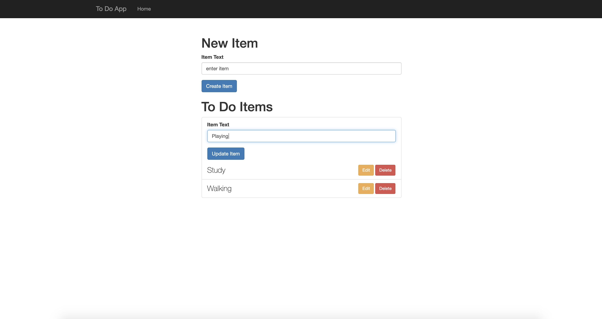

# ToDoList-with-Ajax
A small todo list website using Ajax where a user can add new todo list, can update it and can delete it. All the list items are save in mongo database

### ScreenShot
* Hame Page

* Edit Page

* Update Page

